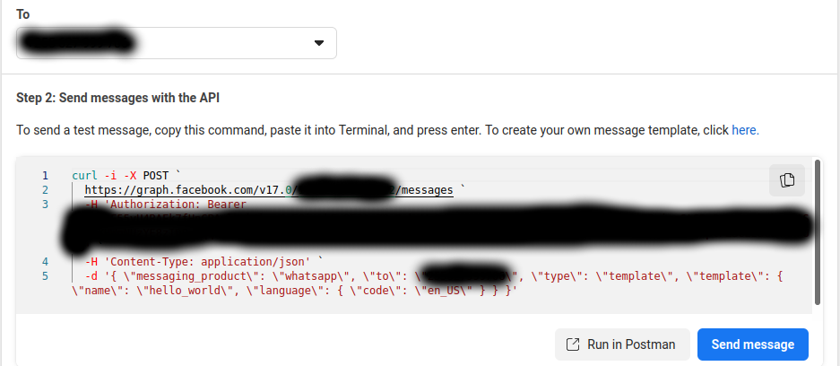
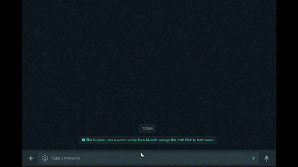

# Sarufi Necta chatbot

This is implementation of [Necta API](https://github.com/vincent-laizer/NECTA-API) by [Vicent](https://github.com/vincent-laizer) using [Sarufi heyoo blueprint](https://github.com/Neurotech-HQ/sarufi-heyoo-blueprint). The blueprint illustrates clearly on how to use it with either of your favourite webhook provider, ngrok or replit.

## Getting started

You'll need a [sarufi account](https://sarufi.io) to create your chatbot, i have included the data used by the bot and [meta developer account](https://developers.facebook.com/)--> to connect your chatbot to whatsapp.

With all collected, let dive a bit into some work how.

You can use any of the services to host your chatbot. There is a replit version also that you can fork, `more info to come`. The illustations below will be using ngrok to expose our local development to internet as we neeed a webhook for whatsapp. So make sure have [ngrok](https://ngrok.com) account and installed set-up on your machine.

## Hands on Work.

This will provide you the basics of how to have this bot running locally. You will have to modify some commands to suite your working environment. The commands like `python3` and `pip3` will depend on your working environment. You may have to use `python` and `pip` instead.

### Create chatbot

First things first we need to create our chatbot. Below are simple steps to create an empty bot

1. Log in Sarufi >> Dashboard
1. Click Create chatbot >> Fill in important infomation such as `name`, `description`, and so on.
1. After creating your cahtbot, you can simply import the [shared data](./Sarufi-data/)
    - State/Flow

        On your newly created chatbot, click on `State Flow Tree` on the left side >> `Import States`.
    - Intents

        On the left of side of your chatbot, click `Intents` >> `import Intents`.

Just simple as you can imagine. Now lets get into some cool integration part. Getting some hands dirt now.

### Create project repo and Virtual env

Lets Make a project folder named `Cool-Bot`. Navigate into it to create virtual evironment `Cool-bot-env`. I actually to work with virtual env, you can read more on [why use virtual env](https://www.freecodecamp.org/news/how-to-setup-virtual-environments-in-python/).

Run the command to make the magic 🔥 happen.

- For unix based systems [Linux and Mac]

    - Install virtual environment.
    
        This step is optional as you may have python virtual environment already installed. If not, you can install it by running the command below.

        ```bash
        sudo apt install python3-venv
        ```

    - Create project folder and virtual environment.

        ```bash
        mkdir Cool-bot
        cd Cool-bot
        python3 -m venv Cool-bot-env
        source  Cool-bot-env/bin/activate
        ```

- For windows

    - Install virtual environment.
    
        This step is optional as you may have python virtual environment already installed. If not, you can install it by running the command below.

        ```bash
        pip install virtualenv
        ```

    - Create project folder and virtual environment.

        ```bash
        mkdir Cool-bot
        cd Cool-bot
        python -m venv Cool-bot-env
        Cool-bot-env\Scripts\activate.bat
        ```

### Clone repo and Install requirements

- Clone the repo.

    You may decide to fork it into your account so the url will be pointing to your fork. This is optional though

    ```bash
    git clone https://github.com/jovyinny/necta-whatsapp-chatbot.git
    ```
- Install dependencies
    
    ```bash
    cd necta-whatsapp-chatbot
    pip3 install -r requirements.txt
    ```
- Create `.env` file

    Navigate into your root directory and create **.env** file to hold environment variable or your creds from sarufi and Meta developer.

    After creating .env file, add the following keys as secrets. Read about [how to get creds](#how-to-get-creds) for more details on sarufi and Meta credentials.

    ```text
    SARUFI_API_KEY = Your API KEY
    SARUFI_BOT_ID = Your Bot Id
    PHONE_NUMBER_ID = whatsapp phone number id
    WHATSAPP_TOKEN = Your Whatsapp token
    VERIFY_TOKEN = Your verify token
    ```
    **Note:** The verification token is a random string. You can just create a random string and use it as your verification token. It will be used to verify your webhook.

### Fire up Ngrok and Python server

- Run Python script.

    Just run(in your activated virtual env) as simple command as;
    ```bash
    python3 main.py
    ```
    or

    ```bash
    uvicorn main:app
    ```

    If you happen to change the default port used here, make sure to use the same port in ngrok section. Default port is `8000`.

- Start Ngork.

    At this stage, i assume you already have ngrok installed. We are going to start our ngrok server to forward all localhost at port `8000`, the default port used by uvicorn. 

    ```bash
    ngrok http 8000
    ```

    Once ngrok runs suceessfully, you will have a public url looking like `https://xxxxxxxxxxx.app` forwarding your `localhost:8000`. Copy the url then move to next step.

### Set Sarufi Webhook.

The chatbot basically will be collecting information from the user. We want a way that sarufi will relay user infor to our script for processing. Here comes a cool feature of sarufi webhook. You jsut need to navigate to your chatbot's setttings >> **Webhooks**.

With your url obtained from above step, add a route `sarufi-hook` so the wehbook url looks like `https://xxxxxxxxxxxx.app/sarufi-hook`.  You will also need to add trigger intents.

Basically these are intents of which at the end of their flow, the collected data during conversation will be relayed to our webhook set. In the file [Metadata](./Sarufi-data/metadata.json), you can see the trigger intents are  `matokeo`,`ufaulu_wa_shule`, and `school_comparison`. So add these as trigger intents. Done with Sarufi webhook, lets finalize Whatsapp webhook below.

### Final Set up

- Setting Whatsapp webhook.

    This is the way we tell whatsapp sever to relay the messages sent to our chatbot to the server. Like, hey whatsapp whenever there is a new message, just push it here(your webhook).

    Lets end our long journey by setting,

    Navigate to your whatsapp cloud account >> **configuration** >> (Webhook) edit >> then paste the url(the one form [live ngrok](#fire-up-ngrok-and-python-server)) into **callback url**. 
    For Verify token, copy the **VERIFY_TOKEN** >> paste into verify token in your whatsapp cloud >> **verify and save**. 

    

- Subcription to Webhook Topic.

    After telling webhook the path that we want to receive all updates, we need to tell the server which kind of updates we are mostly interested on. We are going to subscribe to messages topic.

    After veryfing and saving whatsapp webook, navigate to webhook fields >> click manage to subscribe to message topic.

    

    Now check out the sample [below](#sample-bot).


### How to get creds

- Sarufi Creds.

Log in into you [sarufi account](https://sarufi.io) >> Navigate to profile >> Authorization to obtain API-Key. For BOT-ID, open your sepcific bot navigate to settings >> general then copy bot-id

- WhatsApp cloud.

    You will need TOKEN and TEST WHATSAPP NUMBER obtained from [Facebook Developer Portal](https://developers.facebook.com/)

    Here are steps to follow for you to get started: 
    - Go to your [apps](https://developers.facebook.com/apps).
    - create an app.
    - Select Business >> Business.
    - It will prompt you to enter basic app informations.
    - Add Whatsapp, when asked to add products to your app
    - Right there you will see a your TOKEN and TEST WHATSAPP NUMBER and its phone_number_id.
    - Lastly verify the number you will be using for testing on the To field.

## Sample bot

Navigate to your whatsapp cloud account >> `API setup` >> scroll down to a field written `To`. Click manage phone number to add you phone number. Follow instructions till you finish.
Click send message to start testing your bot. You will receive a message from your test number which your will use in testing your bot.



The bot is  action can be seen in the gif below.




## Issues.

If you will face any issue, please raise one so as we can fix it as soon as possible.

## Contribution.

If there is something you would like to contribute, from typos to code to documentation, feel free to do so, JUST FORK IT. 

## Credits.
All contributors.